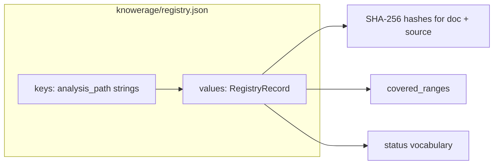

# Knowerage MCP — AI Analysis Coverage Management

Use this MCP server when analyzing legacy code, tracking which source lines are documented, and reconciling analysis freshness. The agent creates `.md` analysis files with coverage metadata and queries the registry for gaps and stale records.

---

## Agent Workflow

### Typical flow

1. **Create analysis** → `knowerage.create_or_update_doc` — Create or update an analysis document with frontmatter (source path, covered line ranges, timestamp).
2. **Reconcile** → `knowerage.reconcile_record` — Reconcile the single analysis record into the registry (call after creating/updating one file).
3. **Query coverage** → `knowerage.list_registry` (full registry snapshot, same shape as `registry.json`), `knowerage.get_file_status`, `knowerage.list_stale`, or `knowerage.get_tree` — Inventory analysis↔source links and ranges, or inspect per-file / stale / tree views.

### When to call reconcile_record vs reconcile_all

| Use case | Tool | When |
|----------|------|------|
| **Single file** | `knowerage.reconcile_record` | Right after creating or updating one analysis file. |
| **Full recalculation** | `knowerage.reconcile_all` | When you need to rescan all analysis files and refresh the registry (e.g. after git pull, bulk edits, or to check if source code changed and analysis is stale). |

### Implicit workflow (analyze = full workflow)

When the user asks to **analyze** or **document** a legacy source file, the agent should perform the full workflow without the user having to say "record coverage":

Before or while planning work, use **`knowerage.get_tree`** to navigate what is already tracked: it returns the registry grouped by **source file directory** (each node lists `directory`, `record_count`, and full `records` with `analysis_path` and `source_path`). Pass optional **`root`** as a path prefix to zoom into a subtree of the code repo (e.g. `src/com/foo/`). To browse by analysis markdown layout under `knowerage/analysis/`, use **`knowerage.list_registry`** with **`analysis_path_prefix`**.

1. Create analysis with `knowerage.create_or_update_doc` (source path, covered line ranges, timestamp).
2. Reconcile with `knowerage.reconcile_record` — this updates **`knowerage/registry.json`** (machine-readable records; do not hand-edit).

The user does not need to say "record coverage" — the agent infers the full workflow from "analyze X" or "document X".

### Registry layout (for mental model)

Same contract as [contracts/contracts.md](contracts/contracts.md). On disk, `registry.json` is one JSON object: keys = analysis markdown paths, values = records (hashes, ranges, status). Example: [examples/registry.sample.json](examples/registry.sample.json).



---

## Reconcile All Use Case

**Scenario**: Source code has been updated (e.g. git pull, refactor, merge) and you need to verify which analyses are now stale.

**Goal**: Recalculate the entire registry to detect:
- `stale_doc` - analysis doc changed since last record
- `stale_src` - source file changed since last record
- `missing_src` - source file no longer exists
- `dangling_doc` - doc exists but record invalid/deleted/malformed

**How to run**:

1. Call `knowerage.reconcile_all` with optional `analysis_glob` (default: `knowerage/analysis/**/*.md`).
2. Inspect the returned `summary` for counts per status.
3. Optionally call `knowerage.list_stale` to get the list of problematic records for remediation.

**Example request**:
```json
{
  "analysis_glob": "knowerage/analysis/**/*.md"
}
```

**Example response**:
```json
{
  "total": 182,
  "fresh": 140,
  "stale_doc": 12,
  "stale_src": 24,
  "missing_src": 3,
  "dangling_doc": 3
}
```

---

## Discovering Analysis Files

- **Glob pattern**: `knowerage/analysis/**/*.md`
- **Location**: Under workspace root, in `knowerage/analysis/`.
- **Validation**: Use `knowerage.parse_doc_metadata` to parse and validate an analysis file's frontmatter before or after creating it.
- **Full discovery**: `knowerage.reconcile_all` discovers and reconciles all files matching the glob.

---

## MCP resources

The current server exposes **tools only** (no `resources/list` or `resources/read`). Use `knowerage.list_registry`, `knowerage.get_file_status`, `knowerage.list_stale`, `knowerage.get_tree`, and `knowerage.coverage_overview` for discovery and coverage data.

---

## Tool Quick Reference

| Tool | Purpose |
|------|---------|
| `knowerage.create_or_update_doc` | Create/update analysis document with metadata |
| `knowerage.parse_doc_metadata` | Parse frontmatter + validate coverage |
| `knowerage.reconcile_record` | Reconcile one analysis record |
| `knowerage.reconcile_all` | Full rescan of the analysis contents and registry.json against the project contents |
| `knowerage.get_file_status` | Analyzed vs missing ranges for one source |
| `knowerage.list_stale` | List stale/problematic records |
| `knowerage.list_registry` | Full registry as structured JSON (`records` = same shape as `registry.json` root; sorted keys). **Prefer this** over opening the file when you need the inventory for planning or mapping sources to analyses. |
| `knowerage.get_tree` | Tree/grouped coverage for UI |
| `knowerage.coverage_overview` | Batch overview: per-source coverage, project file/line totals, stale list |
| `registry.export_report` | Export snapshot (JSON/YAML/TXT/HTML) |
| `knowerage.generate_bundle` | Export selected analyses to `toc*.md` / `combined*.md` / `manifest.json` under `output_dir` (chunked; see [contracts/contracts.md](contracts/contracts.md)) |

---

## Path & Security

- All paths must be under workspace root.
- Path traversal (`..`) and absolute paths outside root are rejected with `E_PATH_TRAVERSAL`.
- Registry: `knowerage/registry.json`
- Analysis files: `knowerage/analysis/**/*.md`
