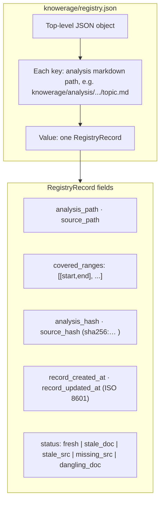

# Knowerage — AI Analysis Coverage Management

Local-first MCP server that tracks legacy code analysis coverage and freshness.

**Source:** [github.com/MTimma/knowerage](https://github.com/MTimma/knowerage)

## Quick Start

### Install via npm
```
npx knowerage-mcp
```

### Or build from source
```
cargo build --release
./target/release/knowerage-mcp
```

## MCP server configuration

Register Knowerage wherever your MCP host expects server definitions (for example some clients use `.cursor/mcp.json` or `.vscode/mcp.json`; others use environment variables or a UI—follow your host’s documentation). Use the same server entry shape:

```json
{
  "mcpServers": {
    "knowerage": {
      "command": "npx",
      "args": ["knowerage-mcp"],
      "env": {
        "KNOWERAGE_WORKSPACE_ROOT": "${workspaceFolder}",
        "KNOWERAGE_AUTO_FULL_RECONCILE": "true"
      }
    }
  }
}
```

Replace `${workspaceFolder}` with your project root if your host does not expand that variable.

`KNOWERAGE_AUTO_FULL_RECONCILE` is optional: when **unset**, **empty**, or not a truthy value, the file watcher defaults to **off**. Set to `1`, `true`, `yes`, or `on` (trimmed, case-insensitive) to enable. When **on**, the server watches `knowerage/` and, after a short debounce, runs `knowerage.reconcile_all` on filesystem changes. That is **not** the same as running a full reconcile after every MCP tool call—it only reacts to file changes under `knowerage/`. Registry writes to `registry.json` are ignored by the watcher so saves do not loop.

## How It Works

1. AI agent creates analysis `.md` files with YAML frontmatter declaring source file and covered line ranges
2. Registry (`knowerage/registry.json`) tracks analysis records with SHA-256 hashes for freshness
3. MCP tools expose create, reconcile, query, and export operations
4. Agent says "analyze X" → full workflow runs automatically (create → reconcile → record)

### Registry file shape (`knowerage/registry.json`)

The on-disk format is a **JSON object** whose keys are analysis paths (strings). Each value is one **record** (see [contracts/contracts.md](contracts/contracts.md)). A full sample with two records lives at [examples/registry.sample.json](examples/registry.sample.json).



Frontmatter for analysis `.md` files is specified separately in the contracts doc (**metadata schema**), not inside `registry.json`.

## MCP Tools

| Tool | Purpose |
|------|---------|
| `knowerage.create_or_update_doc` | Create/update analysis document |
| `knowerage.parse_doc_metadata` | Parse and validate frontmatter |
| `knowerage.reconcile_record` | Reconcile one analysis record |
| `knowerage.reconcile_all` | Full rescan/rebuild |
| `knowerage.get_file_status` | Analyzed vs missing ranges |
| `knowerage.list_stale` | List stale/problematic records |
| `knowerage.list_registry` | Full registry snapshot (same shape as `registry.json`, sorted keys) |
| `knowerage.get_tree` | Tree/grouped coverage |
| `registry.export_report` | Export snapshot (JSON/YAML/TXT/HTML) |
| `knowerage.generate_bundle` | Chunked export of selected analyses (`toc*.md`, `combined*.md`, `manifest.json`) |

## Project Structure

```
knowerage/                  # Created per-project
├── analysis/              # Analysis markdown files
│   └── **/*.md
└── registry.json          # Coverage registry

src/                       # Rust MCP server
├── main.rs
├── lib.rs
├── types.rs
├── parser.rs
├── registry.rs
├── mcp.rs
├── security.rs
└── export.rs
```

## Documentation

- [User Onboarding](docs/USER_ONBOARDING.md) — Setup, config, typical usage
- [INSTRUCTIONS.md](INSTRUCTIONS.md) — MCP agent instructions
- [Rust Practices](docs/PRACTICES_RUST.md)
- [JS Practices](docs/PRACTICES_JS.md)
- [Contracts](contracts/contracts.md) — Schemas and API contracts (registry + frontmatter)
- [Example registry JSON](examples/registry.sample.json) — Sample `registry.json` contents

## Security

- All paths validated against workspace root
- Path traversal (`..`) rejected
- Atomic writes for registry (crash-safe)
- No secrets in analysis files or reports
- SHA-256 hash-based freshness (survives git pull)

## License

[MIT](LICENSE) — copyright Martins Timma.

Parts of this project were written or refined with **generative AI coding assistants**. Human review applies to design, security-sensitive behavior, and releases.